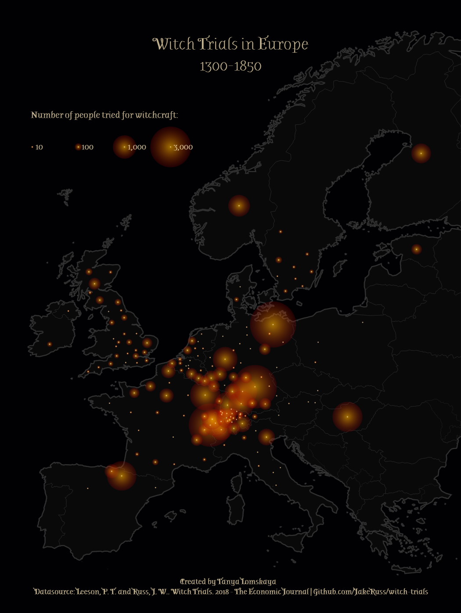

## Witch Trials in Europe 1300-1850

This interactive map was created for the [MapPromptMonday](https://github.com/MapPromptMonday/MapPromptMonday) challenge for May 15th, 2023 ("Proportional Symbols"). 

## Datasources
[Witch trials dataset](https://github.com/JakeRuss/witch-trials) | [Eurostat Coastlines](https://ec.europa.eu/eurostat/web/gisco/geodata/reference-data/administrative-units-statistical-units/coastal) | [Eurostat NUTS](https://ec.europa.eu/eurostat/web/gisco/geodata/reference-data/administrative-units-statistical-units/nuts) | [Europe GeoJSON](https://github.com/leakyMirror/map-of-europe)

## More on the subject

- [Peter T. Leeson & Jacob W. Russ, 2018. "Witch Trials," Economic Journal, Royal Economic Society, vol. 128(613), pages 2066-2105, August.](https://www.peterleeson.com/witch_trials.pdf)
- [QUARTZ: Germany was once the witch-burning capital of the world. Here’s why](https://qz.com/1183992/why-europe-was-overrun-by-witch-hunts-in-early-modern-history)
